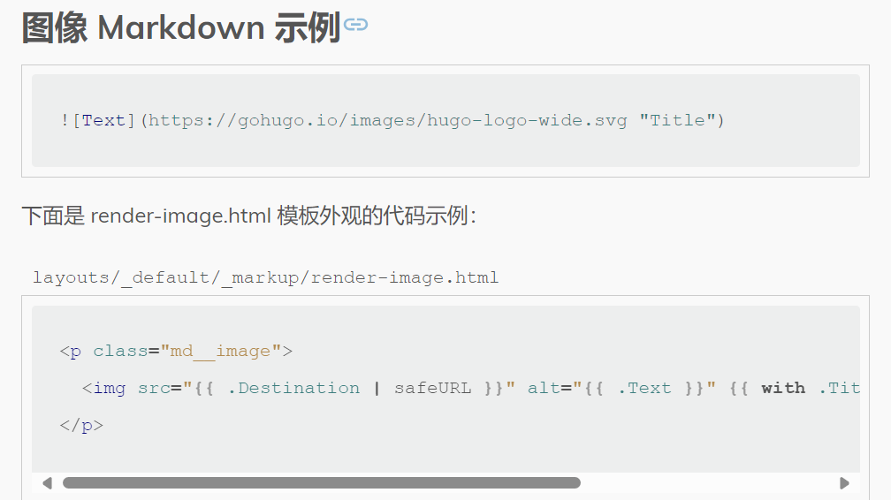

+++
title = 'hugo+stack搭建笔记'
date = 2023-12-04T20:10:00+08:00
draft = false
+++

## hugo+stack搭建笔记

## 下载安装hugo：

[Releases · gohugoio/hugo (github.com)](https://github.com/gohugoio/hugo/releases)

[hugo_extended_0.120.4_windows-amd64.zip](https://github.com/gohugoio/hugo/releases/download/v0.120.4/hugo_extended_0.120.4_windows-amd64.zip)

一般下载extended版本。解压后就一个hugo.exe可用，也没必要配置什么系统变量，直接复制到D盘吧。

## 新建hugo

本例目录hugo_blog

```
hugo new site hugo_blog
```

当然，你也可以先创建仓库，clone下来，用force参数，在已存在的目录创建hugo

```
hugo new site hugo_blog --force
```

## 安装模板

进入hugo目录，添加子模块

```
git submodule add https://github.com/CaiJimmy/hugo-theme-stack/ themes/hugo-theme-stack
```

## 复制模板例子

themes\hugo-theme-stack\exampleSite  这里是模板示例，将这里的文件全部复制到hugo_blog目录

## 启动hugo

将刚才D盘的hugo.exe也复制进hugo_blog目录

删除hugo_blog目录的hugo.toml配置文件，我们使用模板示例时，配置文件不在这里，会冲突，删了就好。

在hugo_blog目录直接运行

```
hugo server
```

http://localhost:1313

访问看看吧。

## 创建分类菜单

创建content\page\categories\index.md

```
title: 分类
date: 2019-05-28
layout: "categories"
slug: "categories"
menu:
    main: 
        name: 分类
        weight: -90
        params:
            icon: categories
```

## 创建标签菜单

创建content\page\tags\index.md

```
title: tags
date: 2019-05-28
layout: "tags"
slug: "tags"
menu:
    main: 
        name: 标签
        weight: -90
        params:
            icon: tag
```

## 修改头像

创建 assets\img\avatar.png

## 修改标题

修改config.yaml

title: 你想要的标题

## 修改副标题

修改config.yaml

sidebar:

    subtitle: 你需要的副标题

## 修改github

修改config.yaml

```
menu:
    main: []

    social:
        - identifier: github
          name: GitHub
          url: https://github.com/jackadam1981
          params:
              icon: brand-github
```

## 修改twitter

修改config.yaml，没有twitter，就注释掉了

```
menu:
    main: []

        # - identifier: twitter
        #   name: Twitter
        #   url: https://twitter.com
        #   params:
        #       icon: brand-twitter
```

## 删除语言

默认设置多语言，我这水平不够，只留中文吧。

修改config.yaml

```
languageCode: zh-cn

DefaultContentLanguage: zh-cn

# languages:
#     en:
#         languageName: English
#         title: Example Site
#         weight: 1
#         params:
#             description: Example description
#     zh-cn:
#         languageName: 中文
#         title: 演示站点
#         weight: 2
#         params:
#             description: 演示说明
#     ar:
#         languageName: عربي
#         languagedirection: rtl
#         title: موقع تجريبي
#         weight: 3
#         params:
#             description: وصف تجريبي
```

## 修改日期格式

修改config.yaml

```
    dateFormat:
        #published: Jan 02, 2006
	published: 2006-01-02
        #lastUpdated: Jan 02, 2006 15:04 MST
	lastUpdated: 2006-01-02 23:04 +8
```

## 创建favicon.ico

创建/static/favicon.ico

编辑config.yaml

```
params:
    mainSections:
        - post
    featuredImageField: image
    rssFullContent: true
    favicon: /favicon.ico #这行
```

## 创建新文章

在终端输入命令创建

powershell命令：

```
 .\hugo.exe new post/202402/taro_vue_note.md
```

CMD命令

```
 hugo new post/202402/taro_vue_note.md
```

## 修改新文章模板

修改文件：archetypes\default.md

```
title: "{{ replace .Name "-" " " | title }}" #标题
description:      #描述、副标题
date: {{ .Date }} #自动生成日期
image:            #图片
math:             #是否开启公式
license:          #许可协议
hidden: false     #隐藏
comments: true    #评论
categories:
    - Test
    - 测试
tags:
    - Test
    - 测试
draft: false      #草稿
```

## 修改图片渲染模板

这步比较重要，我就在这里卡了2天，23年12月写了点文章，在vscode预览挺好的。上传也没注意。

最近又写了两篇，发现图片渲染不正确，路径缺失，hugo编译静态后，图片路径并不在文档相对路径。

[How to use render-image.html to customize the rendering image path - support - HUGO (gohugo.io)](https://discourse.gohugo.io/t/how-to-use-render-image-html-to-customize-the-rendering-image-path/48103/3)

创建layouts\\_default\\_markup\render-image.html

```
<p class="md__image">
  
</p>
```

[Markdown 渲染钩子 |雨 果 (gohugo.io)](https://gohugo.io/templates/render-hooks/)



在src路径中添加了  /{{ path.Dir page.File }}/

终于全部解决，可以愉快的写博客了。
