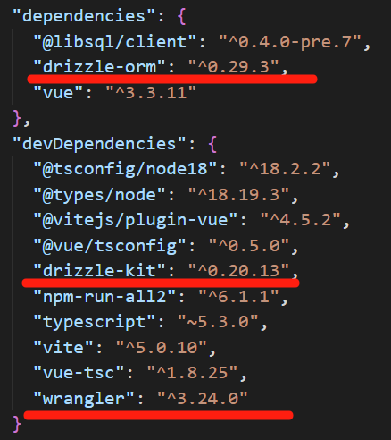

## 简介：

D1数据库是cloudflare提供的一个无服务器模式的数据库，基于sqlite，也够用，绑个信用卡，自己的app就能用了，够你自己折腾的，要啥自行车啊？

[Cloudflare D1 · Cloudflare D1 docs](https://developers.cloudflare.com/d1/)

习惯了python的orm，在vue也想用orm，找到一个毛毛雨。

[Drizzle ORM - next gen TypeScript ORM.](https://orm.drizzle.team/)

ts？上一篇是js，重建一个项目吧，选一下ts支持。

## 安装包

Drizzle其实是3个工具包：ORM , Kit , Studio

分别是ORM模型映射工具，Kit 数据库版本管理工具 ，Studio 可视化数据库管理工具。

对比python，那就是 sqlalchemy模型映射工具  alembia数据库版本管理

PHP : phpdbadmin 不管哪里跑的可视化管理工具

不管了，全安装再说。

[毛毛雨ORM - SQLite (drizzle.team)](https://orm.drizzle.team/docs/get-started-sqlite)

我们试用的D1，说是sqlite，就这个吧。在项目文件夹运行。

```
npm i drizzle-orm @libsql/client
npm i -D drizzle-kit
```

还有cf的cli包。

```
npm install wrangler --save-dev
```

检查package.json,安装正常。



## 创建D1数据库

```
wrangler d1 create <DATABASE_NAME> 
```

## 执行sql创建表结构
