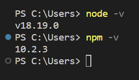
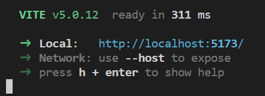
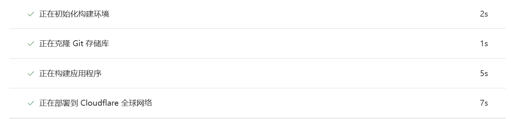
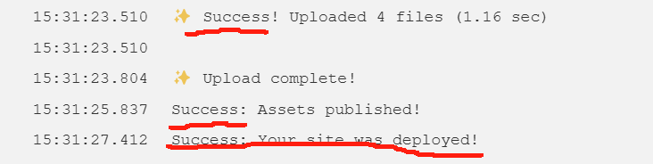

## 简介：

cloudflare真是大好人啊。免费的workers，pages，D1数据库，R2存储。

不搞点什么真对不起垃圾佬的称号。

## 安装node

[Node.js (nodejs.org)](https://nodejs.org/en)  下载安装



检查各版本，就是装好了。

## 初始化vue项目

```
npm create vue@latest

Vue.js - The Progressive JavaScript Framework

√ 请输入项目名称： ... vue_on_cloudflare_workers
√ 是否使用 TypeScript 语法？ ... 否 / 是
√ 是否启用 JSX 支持？ ... 否 / 是
√ 是否引入 Vue Router 进行单页面应用开发？ ... 否 / 是
√ 是否引入 Pinia 用于状态管理？ ... 否 / 是
√ 是否引入 Vitest 用于单元测试？ ... 否 / 是
√ 是否要引入一款端到端（End to End）测试工具？ » 不需要
√ 是否引入 ESLint 用于代码质量检测？ ... 否 / 是

正在构建项目 D:\VueTest\vue_on_cloudflare_workers...

项目构建完成，可执行以下命令：

  cd vue_on_cloudflare_workers
  npm install
  npm run dev
```

## 试运行

刚才组后三行命令，逐个输入即可。



访问“http://localhost:5173”即可访问


## 上传github

我的vscode已经登录github，可以直接提交发布，写个名字就好了。

不会的话，就手动上传吧。

## 创建pages

登录cloudflare，创建pages,连接git，选择刚才的项目，模板选vue。





点击访问站点即可尝试访问了。


当然有墙，需要自定义域名才能自由访问。

## 自定义域名

点击你的pages名字，自定义域设置一下吧。


