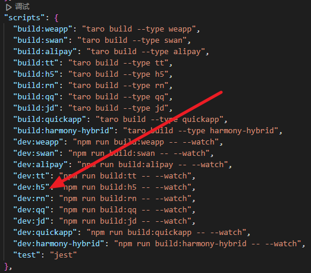
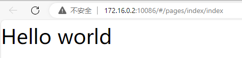
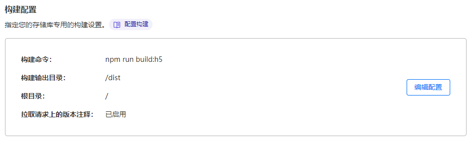

## 简介：

本来想着用低代码平台，钉钉宜搭、微信云微搭，结果发现微信云微搭只有4小时访问时间，钉钉宜搭又不符合马化腾培养的中国网民（全民微信QQ）。

又想贴近国人的使用习惯，还是微信小程序吧。再看微信小程序，要服务器，省点心用宜搭又没办法调用硬件拍照。最终只剩下一条路：小程序+服务器。

主流的几个小程序框架、几个主流的nodejs框架，最终选择了taro+vue的组合。铁公鸡还得找服务器，好人cloudflare提供了pages、D1、R2一堆各种各样的免费服务，量大管饱，非营运的量基本都给你免费了。

## 安装：

[安装及使用 | Taro 文档 (jd.com)](https://taro-docs.jd.com/docs/GETTING-STARTED)

```
npm install -g @tarojs/cli
taro init myApp  #创建myApp目录，根据提示完成即可
cd myApp
npm install
```

安装就这么多，后面根据进度添加依赖包。

## 测试：

观察package.json



暂时关注cloudflare的部署，调试H5即可。

运行以后看到"Hello world"就算成功了。



## 部署:

cloudflare pages有两种部署方式：git 或wrangler，我们优先使用git，版本管理可回退。

创建项目并上传即可。vscode非常方便，提交，发布即可。

cloudflare创建应用程序，选择pages，连接到Git，选你刚创建的项目。

构建命令npm run build:h5,输出目录dist即可。



构建完成后访问，也可以看到hello world。
