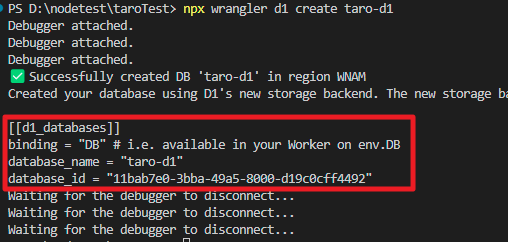
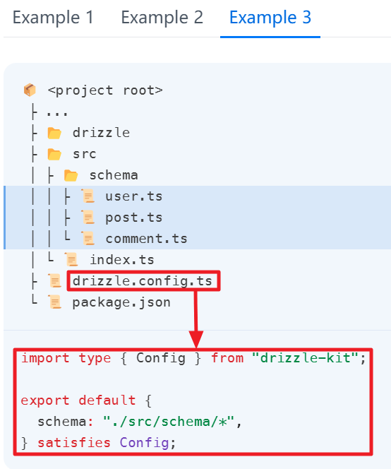
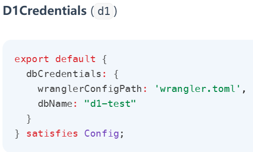
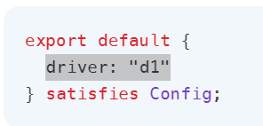
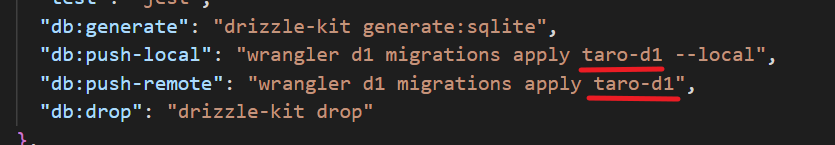
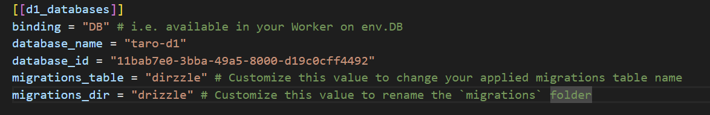

## 简介：

习惯了orm，还是准备为vue项目使用orm，为了支持cloudflareD1，找到了drizzle-orm。

## 安装：

[Drizzle ORM - SQLite](https://orm.drizzle.team/docs/get-started-sqlite#cloudflare-d1)

```
npm i drizzle-orm
npm i -D drizzle-kit
```

[Install/Update Wrangler · Cloudflare Workers docs](https://developers.cloudflare.com/workers/wrangler/install-and-update/)

```
npm install wrangler --save-dev
```

## 创建数据库：

[Get started · Cloudflare D1 docs](https://developers.cloudflare.com/d1/get-started/)

## 登录cloudflare

```
npx wrangler login
```

创建数据库：

数据库名 taro-d1

```
npx wrangler d1 create taro-d1
```



将红框内的复制出来，写入wrangler.toml配置文件

## 创建ORM数据关系映射

[Drizzle-kit - 快速入门](https://orm.drizzle.team/kit-docs/quick)

## 配置文件：

[Drizzle ORM - Configuration](https://orm.drizzle.team/kit-docs/conf)

根目录创建drizzle.config.ts

配置schema：模型定义

配置out：迁移文件目录



```
import type { Config } from "drizzle-kit";
export default {
  schema: "./src/schema/*",
  out: "./drizzle",
} satisfies Config;
```

[Drizzle ORM - 配置参考](https://orm.drizzle.team/kit-docs/config-reference#options)

还有一些其他的参数需要配置

先配置一个DB凭证，注意绿色，配置文件为wrangler.toml，读取数据库名d1-test，我用的是taro-d1，最终配置文件会改的。



再配置一个驱动



最终配置：

```
import type { Config } from "drizzle-kit";
export default {
  schema: "./src/schema/*",
  out: "./drizzle",
  driver: "d1",
  dbCredentials: {
    wranglerConfigPath: "wrangler.toml",
    dbName: "taro-d1",
  },
} satisfies Config;

```

## 创建数据库结构

刚才我们的配置文件是按例子3写的，所以继续创建users.ts

[Drizzle ORM - SQLite](https://orm.drizzle.team/docs/column-types/sqlite#integer)数据类型

```
//src/schema/users.ts
import { text, integer, sqliteTable } from "drizzle-orm/sqlite-core";

export const user = sqliteTable("user", {
  id: integer("id", { mode: "number" }).primaryKey({ autoIncrement: true }),
  name: text("name"),
  email: text("email"),
  password: text("password"),
  role: text("role").$type<"admin" | "customer">(),
  createdAt: integer("id", { mode: "timestamp_ms" }),
  updatedAt: integer("id", { mode: "timestamp_ms" }),
});

```

## 迁移（数据库版本升级）

[Drizzle ORM - List of commands](https://orm.drizzle.team/kit-docs/commands)

[Migrations · Cloudflare D1 docs](https://developers.cloudflare.com/d1/reference/migrations/)

其实Drizzle暂时还不支持D1的推送，但是wrangler也不支持跟踪创建迁移文件。结合用吧。

配置package.json，添加"scripts"脚本如下，红线标记的taro-d1，是创建数据库时的数据库名。



generate，创建迁移文件是由drizzle-kit来完成的，刚才创建的drizzle.config.tz，已经配置了监听的数据库结构，输出路径，数据库驱动类型。

drop，也是由drizzle-kit来完成，用来删除迁移文件，虽然可能用不上，但是我们有本地调试，未git上传部署时还是可以用一用的。

push，是由wrangler来完成，为了方便本地调试，我创建了本地和远程两条命令，区别只是--local。

继续配置：

修改wrangler.tom

增加的两行是

migrations_table，迁移记录的表名，要有跟踪记录才能知道哪条迁移文件没有被执行。

migrations_dir，迁移记录的目录，所有的迁移文件都在这个文件夹，我们是用drizzle-kit来生成的迁移文件，就指定为一致的drizzle了。

执行一下试试吧。
