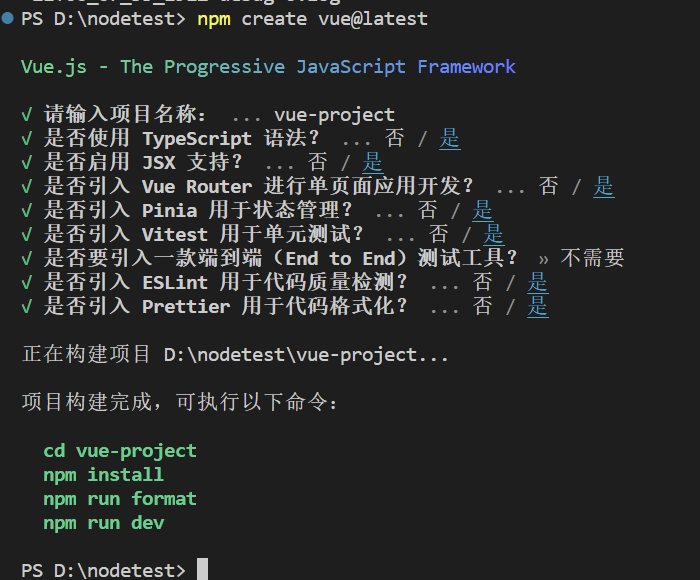
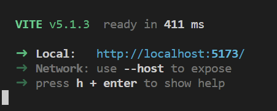
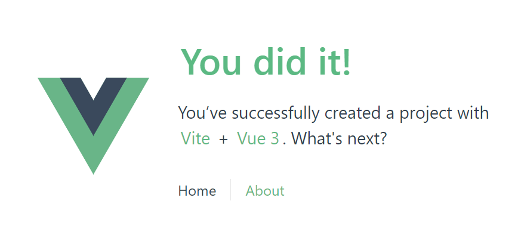
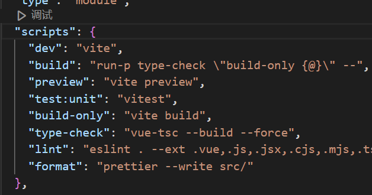
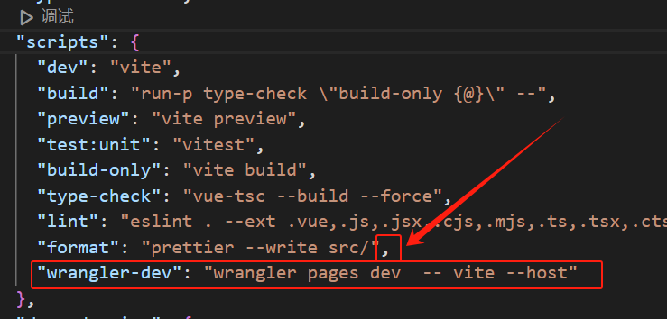
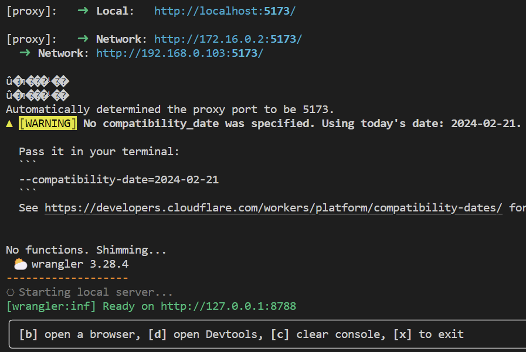
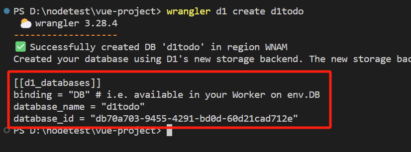
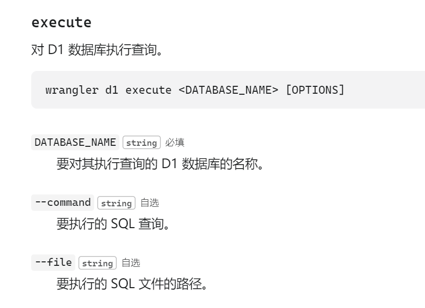
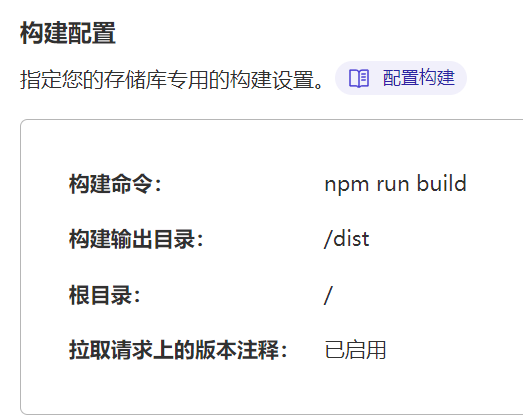
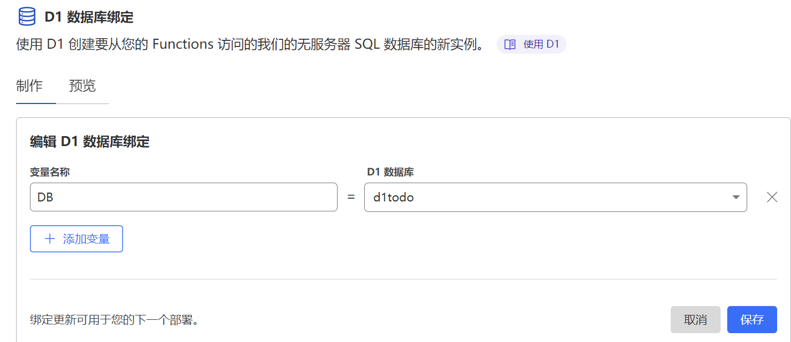

## Cloudflare Todo VUE D1

## 简介：

最近一直在尝试用vue框架做个小程序，后来发现到处实名备案……

无奈，整H5吧，还是老伙计cloudflare，先做todo。

## 创建vue项目

* 安装node.js
* 安装vscode
* 打开vscode的终端，进入一个方便的目录，运行下面的命令创建vue项目，随便选即可。
* `npm create vue@latest`

  

随便选吧，根据提示的绿色代码，逐行执行，即可启动一个默认的vue项目。

项目名称就是你的项目主目录。以后说的命令都将在你的项目主目录执行。



访问5173即可。也可以按着ctrl点击这里的地址。



看来你搞定了。

## 安装wrangler

[Install/Update Wrangler · Cloudflare Workers docs](https://developers.cloudflare.com/workers/wrangler/install-and-update/)

`npm install wrangler --save-dev`

这个是cloudfalre的官方工具，除了它，别的不好用啊。

测试通过wrangler启动vue测试模式。

编辑package.json,如果你用的是vscode，会看到一个调试按钮，很方便的，刚才vue提示你的最后一条命令是啥？？npm run dev。dev就在这里，我们其实是去执行了dev后面的命令。可以在这里直接点击调试，然后选择dev。



在最后一行添加

`"wrangler-dev": "wrangler pages dev  -- vite --host"`

记得json格式，上面一行还要添加一个引文半角逗号","



用调试按钮启动它试试看，多了一个8788端口的地址。



访问8788，一切如只使用vue一样。证明你的项目可以跑在cloudflare pages上了。

## 创建数据库

顺便介绍drizzle。

### 安装

```
npm i drizzle-orm
npm i -D drizzle-kit
```

### 数据表设置

创建文件：src/schema/todos.ts

```
import { sql } from "drizzle-orm";
import { text, integer, sqliteTable } from "drizzle-orm/sqlite-core";

const todos = sqliteTable('todos', {
  id: integer('id', { mode: 'number' }).primaryKey({ autoIncrement: true }),
  textModifiers: text('text_modifiers').notNull().default(sql`CURRENT_TIMESTAMP`),
  intModifiers: integer('int_modifiers', { mode: 'boolean' }).notNull().default(false),
});

```

### drizzle设置

创建配置文件drizzle.config.ts

```
import type { Config } from "drizzle-kit";
export default {
  schema: "./src/schema/*",
  out: "./drizzle",
  driver: "d1",
  dbCredentials: {
    wranglerConfigPath: "wrangler.toml",
    dbName: "taro-d1",
  },
} satisfies Config;

```

### 生成命令

`"db:generate":"drizzle-kit generate:sqlite",`

将生成命令配置进package.json


生成1tables，一个sql指令文件

### 创建数据库 `<d1todo>`

1. 执行命令
2. `wrangler d1 create <DATABASE_NAME>`
3. 

### 配置

1. 创建配置文件wrangler.config.ts
2. 内容是上一步的结果，就红色部分粘贴过来即可。
3. 增加一行： `migrations_dir = "drizzle"`
4. 这行配置是使用我们drizzle来自动生成迁移文件。wrangler没有监听声明和自动生成功能。

### 推送数据库

1. 命令
2. `wrangler d1 migrations apply <DATABASE_NAME> [OPTIONS] `
3. 将推送命令配置进package.json
4. options可以选填 --local，本地模式
5. ```
       "DB:generate":"drizzle-kit generate:sqlite",
       "DB:apply-local":"wrangler d1 migrations apply d1todo --local",
       "DB:apply-remote":"wrangler d1 migrations apply d1todo",
       "wrangler-dev": "wrangler pages dev  -- vite --host"
   ```

表结构而已，我两个都推了。

## 测试



1. 一个简单的命令 `SELECT name FROM sqlite_master WHERE type='table' order by name`
2. d1执行命令 `wrangler d1 execute <DATABASE_NAME> [OPTIONS]`
3. 完整命令：`wrangler d1 execute d1todo --command="SELECT name FROM sqlite_master WHERE type='table' order by name" `
4. 本地数据库命令：`wrangler d1 execute d1todo --command="SELECT name FROM sqlite_master WHERE type='table' order by name" --local`
5. 相信你也看出来--local了，

## FUNCTIONS

这个是pages的一个功能，有着特殊的路由解析规则，似乎应该优先于我们编写的代码。

[Functions · Cloudflare Pages docs](https://developers.cloudflare.com/pages/functions/)

创建文件functions/api/helloworld.ts

```
export function onRequest(context) {
  return new Response("Hello, world!")
}
```

测试一下，运行 `wrangler-dev`

访问：[127.0.0.1:8788/api/helloworld](http://127.0.0.1:8788/api/helloworld)

仅仅返回 Hello, world!

好吧，我们继续测试

创建functions\api\gettables.ts文件

```
import { D1Database } from '@cloudflare/workers-types/experimental';

/**
 * Environment variables type definition.
 */
export interface Env {
    DB: D1Database;
}
export const onRequestGet: PagesFunction<Env> = async (context) => {
    return new Response(JSON.stringify(await getAll(context.env)));
};

const getAll = (env: Env) =>
    env.DB.prepare(`select name FROM sqlite_master WHERE type='table' order by name`).all();
```

有了新导入，需要安装一下：`npm install @cloudflare/workers-types`

访问：[127.0.0.1:8788/api/gettables](http://127.0.0.1:8788/api/gettables)

可以看到和我们直接命令执行的一样了。

这将是我们连接D1数据库的第一步。

有了这样的接口，怎么写vue就不在本文讨论了。

## FUNCTIONS(drizzleORM)

为了使用ORM，还得用functions。

创建文件 functions\api\drizzle.ts

```
//导入模型定义
import { todos } from '../../src/schema/todos';
//导入ORM
import { drizzle } from 'drizzle-orm/d1';
import { eq } from 'drizzle-orm';
//配置DB数据类型，TS需要
export interface Env {
    DB: D1Database;
}

//使用orm进行查询
//select全部
// export const onRequestGet: PagesFunction<Env> = async (context) => {
//     const db = drizzle(context.env.DB);
//     const result = await db.select().from(todos).all();
//     return Response.json(result);
// };
//select 部分字段，并使用自定义字段名
// export const onRequestGet: PagesFunction<Env> = async (context) => {
//     const db = drizzle(context.env.DB);
//     const result = await db.select({
//         id: todos.id,
//         textModifiers: todos.textModifiers,
//     }).from(todos)
//     return Response.json(result);
// };
//query查询
//columns是列参数，默认是true，只需要设置false即可。
//where是查询条件，eq就是等于的意思。更多运算符：https://orm.drizzle.team/docs/operators
export const onRequestGet: PagesFunction<Env> = async (context) => {
    const db = drizzle(context.env.DB, { schema: { todos } });
    const result = await db.query.todos.findMany({
        columns: {
            id: false,
            textModifiers: true,
            intModifiers: true,
        },
        where: eq(todos.intModifiers, true)
    });
    return Response.json(result);
};
```

简单写了两个，需要的时候查手册[https://orm.drizzle.team/docs/operators](https://orm.drizzle.team/docs/operators)

## 部署

推送到github，在cloudflare部署一个pages，



绑定数据库

在这个pages中   设置--函数--D1 数据库绑定  添加数据库绑定



### 告警

打开gettables.ts时，还是有红色报警的。

抄来的一个配置文件，可以解决这个问题。

创建functions/tsconfig.json

```
{
  "compilerOptions": {
    "baseUrl": "..",
    "module": "esnext",
    "target": "esnext",
    "lib": ["esnext"],
    "alwaysStrict": true,
    "strict": true,
    "preserveConstEnums": true,
    "moduleResolution": "node",
    "sourceMap": true,
    "esModuleInterop": true,
    "types": ["@cloudflare/workers-types"],
    "paths": {
      "@/*": ["src/*"],
      "*": [
        "node_modules/*",
        "*"
      ],
    }
  }
}

```

这样就没有那个告警了。TS也不是很熟悉，就先这样吧。

感谢https://github.com/jim60105/simple-poll-system.git

基本是这里学了点皮毛。
