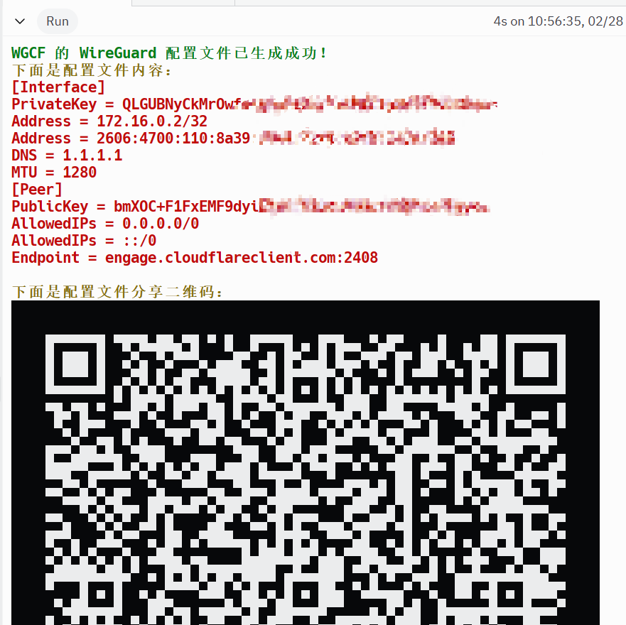

## 简介：

最近总是用cloudflare的WARP。使用的是wireguard客户端，使用warp的节点。

介绍一下使用要点吧。

## 安装：

简单点，可以直接安装wireguard客户端，但是默认客户端是在线安装模式，又被墙了，那么就下载离线安装包把。

[WireGuard for Windows Downloads](https://download.wireguard.com/windows-client/)

我也转一下吧，方便菜鸟。

[Msi install for amd64](\download\wireguard-amd64-0.5.3.msi)
[Msi install for arm64](\download\wireguard-arm64-0.5.3.msi)
[Msi install for x86](\download\wireguard-x86-0.5.3.msi)

## 创建节点

WARP客户端现在可以不装了，直接replit在线生成节点挺好的。

生成的还正是wireguard配置文件。

[misaka-blog (MisakaNo の 小破站) - Replit](https://replit.com/@misaka-blog)  他家好几个脚本呢，都是在线的。

下面是生成wireguard的脚本

[warpgo-profile-generator - Replit](https://replit.com/@misaka-blog/warpgo-profile-generator?v=1)

[wgcf-profile-generator - Replit](https://replit.com/@misaka-blog/wgcf-profile-generator?v=1)

fork & run 就能获取。记得选免费账户，1.

这个域名估计墙了，得优选一下IP。

## 优选IP

[yonggekkk/warp-yg: warp多功能一键脚本，查看VPS本地IP、netflix、chatgpt(网页与客户端)是否解锁等情况、endpoint对端优选IP等功能，VPS平台与Replit平台无限生成warp配置文件 (github.com)](https://github.com/yonggekkk/warp-yg)

这里有勇哥的win端自选IP脚本，优选以后，替换配置文件的Endpoint。

## 使用wireguard

导入隧道文件 *.conf

刚才获取的信息，保存为  任意文件名.conf，导入进去，连接即可。

或者手机也装wireguard，直接扫描二维码，链接即可。

## 分流

[lmc999/auto-add-routes: China Route for VPN (github.com)](https://github.com/lmc999/auto-add-routes)

这里有大佬做了分流脚本，可以配合wireguard来使用。
